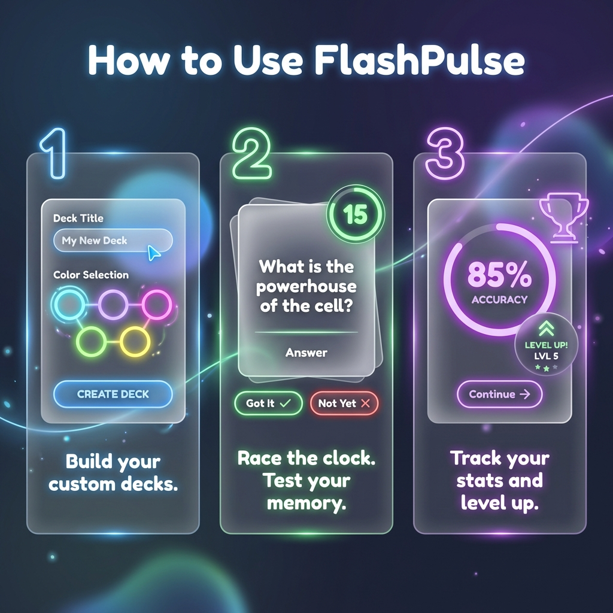

# FlashPulse

A lightweight, self-hosted flashcard app. Create decks, add cards, and quiz yourself. This repository contains a Vite + React frontend and a minimal Express backend for storing decks locally.

## Quick start (local)

1) Start the backend (port 4000):

```bash
cd backend
npm install
npm start
```

2) Start the frontend (Vite dev server):

```bash
cd ..
npm install
npm run dev
```

Open the Vite dev server address (usually http://localhost:5173).

## Backend API
- GET `/api/decks` — returns all decks (array)
- POST `/api/decks` — replace all decks (body: array)
- PUT `/api/decks/:id` — upsert a single deck (body: deck object)
- DELETE `/api/decks/:id` — delete a deck by id

Example:

```bash
curl http://localhost:4000/api/decks
```

## Project structure
- `App.tsx` — main frontend app
- `components/DeckEditor.tsx` — deck creation/editing UI
- `components/QuizView.tsx` — quiz UI
- `services/storage.ts` — frontend persistence layer (talks to backend)
- `backend/index.js` — minimal Express backend storing data at `backend/data/decks.json`

<<<<<<< HEAD
=======
## Notes
- If you deploy the backend publicly, secure it with authentication and HTTPS.
- If you want the README to replace the repository README, tell me and I will rename it to `README.md` directly.


# Run and deploy your FlashPulse app

This contains everything you need to run the frontend locally and a simple self-hosted backend to store decks.

## Run Locally

**Prerequisites:** Node.js

1. Install frontend dependencies:

```bash
npm install
```
>>>>>>> 8b9a6f04de2750c055f43d5fd0a0b76f95afb60e

2. Start the backend (from the project's root):

```bash
cd backend
npm install
npm start
```

The backend will listen on port 4000 by default and exposes a simple JSON API at `/api/decks`.


## Visual User Guide



### How to Use FlashPulse

1.  **Launch the App**:
    *   Ensure the backend is running (`npm start` in `/backend`).
    *   Ensure the frontend is running (`npm run dev` in root).

2.  **Create a Deck**:
    *   Click the **"CREATE DECK"** button on the home dashboard.
    *   Enter a Title (e.g., "Cosmic Trivia") and select a neon accent color.

3.  **Add Knowledge**:
    *   Use the **Deck Editor** to add cards.
    *   **Front**: The question (e.g., "What is the powerhouse of the cell?").
    *   **Back**: The answer (e.g., "Mitochondria").

4.  **Start a Session**:
    *   Hit the **"Start Quiz"** button on any deck.
    *   **Race the Clock**: You have 15 seconds to flip the card!
    *   **Self-Rate**: Mark yourself as "GOT IT" (Green) or "NOT YET" (Red).

5.  **Track Mastery**:
    *   At the end, view your **Accuracy Score** and decide if you need to "Continue Mission".
